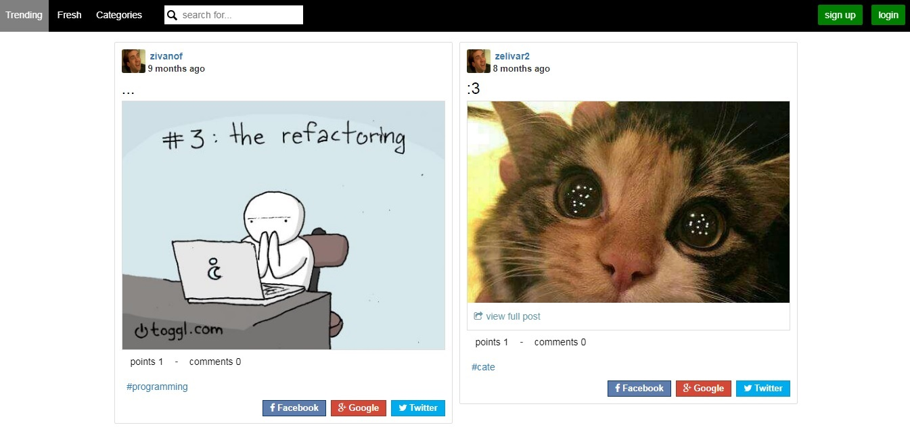

# 9gag demo application

Features
-------------

- Auth: sign up, login, logout
- Update profile info, profile picture, etc.
- Post image or gif posts
- Like, comment and share posts
- Add posts to categories and add tags
- Search posts by tags
- View posts by categories
- View trending or fresh posts
- View user profile containing liked, commented and uploaded posts

Purpose
-------------
This project was part of a university course assignment for creating a web application.

Description
-------------
This applican is a simpler implementation of [http://9gag.com/](http://9gag.com/) as user can register/login and create, like, comment, share update. The purpose of this application is entirely for learning purpose.

Set up project
-------------

* Change project location and database info in 'config/local-params.php'
* Install and run composer. [Composer's getting started page](https://getcomposer.org/doc/00-intro.md)
* Run the following console command in the project main directory to set up the database: php cw_console.php db/init
* install ffmpeg [Ffmpeg website](https://www.ffmpeg.org/) (used to convert gifs to videos)

Working example: [http://fun.vivanof.com/](http://fun.vivanof.com/)
